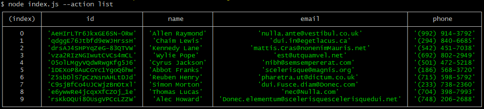

# Node.js homework 1

1. Получаем и выводим весь список контактов в виде таблицы (console.table)
   
2. Получаем контакт по id
   
3. Добавялем контакт
   
4. Удаляем контакт
   
   (./assets/screenshot_4.png)
